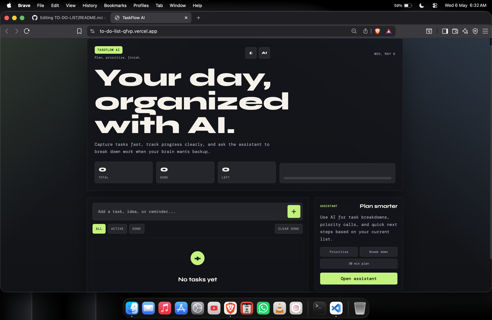

# TaskFlow AI - To-Do List App 🚀

TaskFlow AI is a modern and responsive to-do list web app that helps users capture tasks, track progress, switch themes, and use an AI assistant to plan work smarter. It is built with HTML, CSS, JavaScript, and a Gemini-powered backend proxy.

## 📸 Project Preview



## ✨ Features

- ✅ Add new tasks quickly
- 📝 Mark tasks as completed
- 🗑️ Delete individual tasks
- 🧹 Clear all completed tasks at once
- 🔍 Filter tasks by `All`, `Active`, and `Done`
- 📊 View live task stats: total, done, and left
- 📈 Track completion progress with a progress bar
- 🌗 Switch between dark and light themes
- 💾 Save tasks and theme preferences in browser `localStorage`
- 🤖 Chat with an AI assistant for priorities, task breakdowns, and quick plans
- 🎨 Smooth animations, floating particles, and responsive UI
- 📱 PWA-ready structure with a service worker and manifest

## 🛠️ Technologies Used

| Technology | Purpose |
|---|---|
| HTML5 🧱 | Creates the page structure and app layout |
| CSS3 🎨 | Handles styling, responsive design, themes, animations, and visual polish |
| JavaScript ⚙️ | Powers task logic, DOM updates, filters, local storage, and AI chat behavior |
| LocalStorage 💾 | Keeps tasks, theme, and AI chat history saved in the browser |
| Python Server 🐍 | Provides a local backend route for the Gemini API |
| Gemini API 🤖 | Generates AI responses for planning, prioritizing, and breaking down tasks |
| Service Worker 📦 | Adds basic offline/PWA caching support |

## 📁 Project Structure

```text
TO-DO-LIST/
├── index.html        # Main HTML page
├── style.css         # App styling, themes, layout, and animations
├── app.js            # Frontend task logic and AI assistant UI
├── server.py         # Local Python backend for /api/gemini
├── api/
│   └── gemini.js     # Serverless Gemini API handler
├── sw.js             # Service worker for caching
├── manifest.json     # PWA manifest
├── TODO.md           # Project notes/tasks
└── README.md         # Project documentation
```

## ⚙️ How It Works

### 1. Task Management ✅

The app stores all tasks in a JavaScript array. Each task has:

```js
{
  id: "unique-id",
  text: "Task text",
  done: false
}
```

When a user adds a task, the app creates a new task object, saves it to `localStorage`, and re-renders the task list on the page.

### 2. Saving Data 💾

Tasks are saved in the browser using `localStorage`, so they stay available after refreshing the page.

The app also saves:

- 🌗 Selected theme
- 💬 Recent AI chat messages

### 3. Filtering Tasks 🔍

The filter buttons update the visible task list:

- `All` shows every task
- `Active` shows unfinished tasks
- `Done` shows completed tasks

The original task list stays saved while only the displayed view changes.

### 4. Progress Tracking 📊

The app counts:

- Total tasks
- Completed tasks
- Remaining tasks

Then it calculates the completion percentage and updates the progress bar width.

### 5. Theme Switching 🌗

The theme button switches between dark and light mode. CSS variables control colors, backgrounds, borders, and shadows, making the design easy to maintain.

### 6. AI Assistant 🤖

The AI assistant panel lets users ask for:

- Task priorities
- Smaller steps
- A focused 30-minute plan
- General planning help

The frontend sends the user prompt and current tasks to:

```text
/api/gemini
```

The backend reads the Gemini API key from an environment variable and safely calls the Gemini API. This keeps the API key out of frontend JavaScript.

## 🚀 How To Run Locally

### Option 1: Run With AI Support 🤖

Create a `.env` file in the project root:

```bash
GEMINI_API_KEY=your_gemini_api_key_here
```

Start the local Python server:

```bash
python3 server.py
```

Open the app in your browser:

```text
http://localhost:8000
```

### Option 2: Run Without AI Support 🌐

You can open `index.html` directly in the browser to use the basic to-do features.

Note: The AI assistant needs the backend server because browser-only code should not expose API keys.

## 🧠 Main JavaScript Concepts Used

- DOM manipulation
- Event listeners
- Array methods like `filter`, `find`, and `unshift`
- Template rendering with created elements
- Browser `localStorage`
- Async/await
- Fetch API
- Theme state management
- Form/input validation

## 🎯 Use Cases

- 📚 Student assignment tracking
- 💼 Daily office task planning
- 🏠 Personal reminders
- 🧩 Breaking big work into smaller steps
- ⏱️ Creating quick focus plans with AI

## 👨‍💻 Author

**GAURAV PANDEY**
